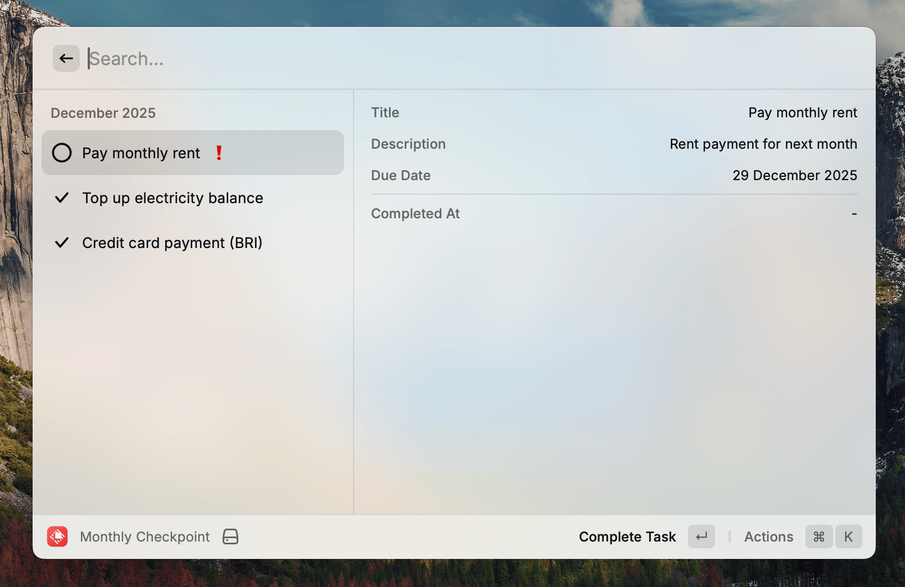

# Monthly Checkpoint

A Raycast extension for tracking your recurring monthly tasks.

## Features

- **Create recurring tasks** with monthly due dates
- **Track completion** with quick toggle actions
- **Monthly views** to navigate between different months
- **Due date alerts** with past-due indicators
- **Task details** including descriptions and completion timestamps
- **Persistent storage** using SQLite database



## Usage

1. Open Raycast and search for "Monthly Checkpoint"
2. Create tasks with title, description, and monthly due date
3. Toggle task completion with a single action
4. Navigate between months to view historical or future tasks

## Setup

```bash
npm install
npm run dev
```

## Requirements

- Raycast for macOS 
- Node.js 22+
